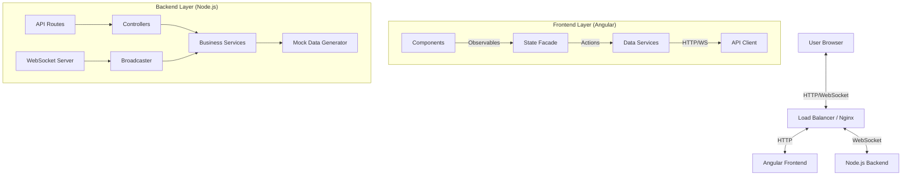

# System Architecture

## Overview

Exp360 is a real-time monitoring dashboard built with a **Clean Architecture** approach, separating concerns between the presentation layer, business logic, and data access. The system consists of a robust Angular frontend and a Node.js/Express backend, deployed as a monorepo on Railway.

## 🏗️ High-Level Architecture



## 🔧 Technology Stack

### Frontend
- **Framework**: Angular 18 (Standalone Components)
- **State Management**: RxJS (BehaviorSubjects, Observables)
- **Styling**: TailwindCSS + Custom CSS Variables
- **Visualization**: Apache ECharts
- **Build Tool**: Angular CLI

### Backend
- **Runtime**: Node.js 20
- **Framework**: Express.js
- **Real-time**: `ws` (WebSocket) library
- **Language**: TypeScript

### DevOps & Deployment
- **Containerization**: Docker (Multi-stage builds)
- **Orchestration**: Docker Compose (Local dev)
- **Cloud Provider**: Railway
- **CI/CD**: GitHub Actions (via Railway auto-deploy)

---

## 📂 Project Structure (Monorepo)

The project follows a strict monorepo structure with shared configuration where applicable.

```
exp360/
├── backend/                 # Backend Service
│   ├── src/
│   │   ├── controllers/     # Request handlers
│   │   ├── services/        # Business logic & WebSocket
│   │   ├── types/           # Shared interfaces
│   │   └── server.ts        # Entry point
│   ├── Dockerfile           # Production build config
│   └── package.json
│
├── frontend/                # Frontend Service
│   ├── src/
│   │   ├── app/
│   │   │   ├── core/        # Singleton services, guards
│   │   │   ├── features/    # Feature modules (Dashboard)
│   │   │   └── shared/      # Reusable components
│   │   └── environments/    # Config files
│   ├── public/              # Static assets & env.js
│   ├── Dockerfile           # Multi-stage build (Node -> Nginx)
│   ├── nginx.conf           # Web server config
│   └── docker-entrypoint.sh # Runtime env injection
│
└── docker-compose.yml       # Local development orchestration
```

---

## 📐 Key Design Decisions

### 1. Clean Architecture in Frontend
We implemented a **Facade Pattern** using RxJS to manage state. Components do not call APIs directly; they subscribe to Observables provided by services.
- **Benefits**: Decoupling, easier testing, reactive UI updates.

### 2. Runtime Environment Configuration
To support "Build Once, Deploy Anywhere", we inject environment variables (API URL, WebSocket URL) at **runtime** rather than build time.
- **Mechanism**: `docker-entrypoint.sh` generates a `public/env.js` file from environment variables, which is loaded by `index.html` before the Angular app starts.

### 3. Real-time Data Streaming
The backend pushes updates via WebSockets rather than the frontend polling for changes.
- **Optimization**: The backend broadcasts updates to all connected clients efficiently.
- **Resilience**: The frontend automatically attempts to reconnect if the connection is lost.

### 4. Docker Optimization
- **Multi-stage builds**: We use `node:alpine` for building and `nginx:alpine` for serving the frontend, keeping image sizes small (<30MB).
- **.dockerignore**: Strictly excludes `node_modules` and other artifacts to speed up build context transfer.

---

## 🚀 Deployment Strategy

The application is deployed on **Railway** using a monorepo setup.

- **Backend**: Deployed as a Node.js service.
- **Frontend**: Deployed as a static site served by Nginx.
- **Communication**: Frontend connects to Backend via public HTTPS/WSS URLs injected via environment variables.

### Environment Variables
| Variable | Description |
|----------|-------------|
| `PORT` | Backend port (default: 3000) |
| `API_URL` | Full URL to backend API |
| `WS_URL` | Full URL to backend WebSocket |

---

## 🔄 Data Flow

1. **Initialization**: Frontend loads, fetches initial `overview` stats via HTTP.
2. **Connection**: Frontend establishes WebSocket connection.
3. **Streaming**: Backend pushes new events (anomalies/updates) every 10-30 seconds.
4. **Reaction**: Angular services receive data -> update BehaviorSubjects -> Components auto-update via `async` pipe.
